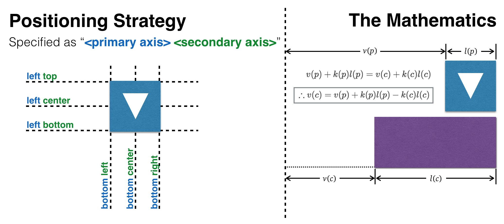

react-overlay-popup
===================

Overlay and Popup components for React. Brought to you by Taskworld Inc.


Synopsis
--------

```jsx
const { Overlay, Popup } = require('react-overlay-popup');
```

See: [src/App.js](src/App.js) for example.


Overlay
-------

Anything inside `<Overlay></Overlay>` will be added to a separate DOM tree appended to `document.body`.
Just that.


Popup
-----

A special kind of Overlay that automatically positions itself relative to its parent.
The position is specified through the `strategy` prop.



The `gap` prop specifies how far should the popup be to its parent.


Acknowledgement
---------------

This project is based off [@glenjamin's fork of react-hot-boilerplate](https://github.com/gaearon/react-hot-boilerplate/pull/28) which makes it super-fast to start developing a new React web app. This fork uses [webpack-hot-middleware](https://github.com/glenjamin/webpack-hot-middleware) to make it easier to work with Webpack's Hot Code Reloading.
